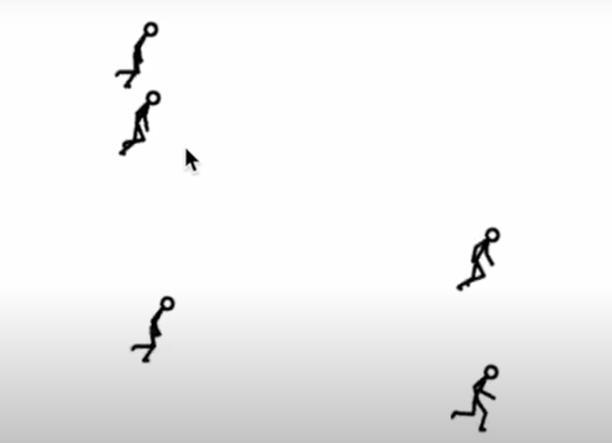

# yiai0424_quiz_8
Summer's week 8 quiz


# 1. here is my Imaging Inspiration

**The inspiration 1**


( The file is too big, need to view raw. Sorry about that)

*description：*

```
I chose that because, although the lines are basic, the design is quite attractive. 
It also makes effective use of the knowledge learned during the class.
```

**The inspiration 2**




( The file is too big, need to view raw. Sorry about that)

*description：*

```
My idea is that the constantly running man rushes through the above mentioned grid in turn, 
and when the man rushes through the grib, the grid breaks into a hole
```

# 2. here is my Coding Exploration