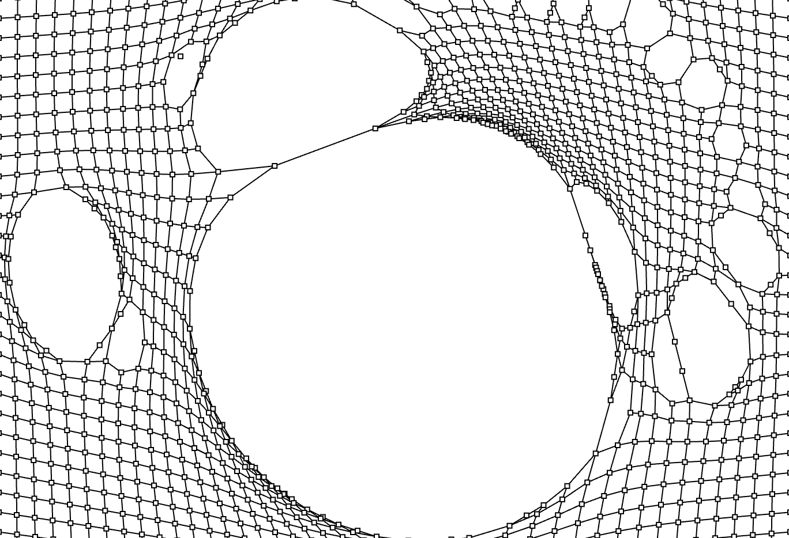

# yiai0424_quiz_8
Summer's week 8 quiz


# 1. here is my Imaging Inspiration

### The inspiration 1




*( The file is too big, need to view raw. Sorry about that)*

**description：**

* I chose that because, although the lines are basic, the design is quite attractive. 
It also makes effective use of the knowledge learned during the class.


### The inspiration 2


*( The file is too big, need to view raw. Sorry about that)*

**description：**

* My idea is that the constantly running man rushes through the above mentioned grid in turn, 
and when the man rushes through the grib, the grid breaks into a hole


# 2. here is my Coding Exploration

### The inspiration 1

**description：**


* Simulation Setup:
```
initializes a simulation with nodes and links arranged in a grid-like structure 
```
* Node and Link Representation: 
```
defines classes for nodes and links
specifying their properties such as position, velocity, and connection
```
* Simulation Loop:
```
use draw() function manages the simulation loop
updating node positions based on forces and link tensions, and rendering the simulation
```
* User Interaction:
```
detects mouse movements and cuts links accordingly
```

*Link of coding example:*
https://openprocessing.org/sketch/2135557


### The inspiration 2

**description：**

* Loading Data and Images:
```
The code containing data about frames and an image file (character.png) containing the sheet
```
* Setup Function:
```
In the setup() function, each frame is then added to an array called animation
```
* Creating Sprite Objects:
```
Creates multiple instances and initializes them with the animation array
specifying their positions and animation speed
```
* Drawing Function:
```
The draw() function is responsible for rendering each frame of the animated 
```

*Link of coding example:*
https://editor.p5js.org/codingtrain/sketches/vhnFx1mml